# Catalyst Cognitive Architecture - Enhanced Memory & Synapse Network

**Generated on:** 2025-07-24 11:08:22  
**Total Files:** 44 across 5 memory systems  
**Total Connections:** 68 synapse pathways

This enhanced chart visualizes the Catalyst cognitive architecture with:

- **Color coding by creation date** - Stack ranked from newest (🟢) to oldest (🔴)
- **Weight-proportional connection lines** - Thickness indicates synapse strength  
- **Directional arrows** - Shows uni/bidirectional influence patterns
- **Stack rankings** - Files numbered by creation order (#1 = newest, higher numbers = older)

## Legend:

**File Age Colors:**
- 🟢 **Very New (≤1 day)**: Emerald green - Recently created files
- 🔵 **New (≤1 week)**: Blue - Recently modified files  
- 🟣 **Recent (≤1 month)**: Purple - Recently updated content
- 🟠 **Older (≤3 months)**: Amber - Established content
- 🔴 **Legacy (>3 months)**: Red - Foundational content

**Connection Weights:**
- **6px lines**: Very High strength (0.95-1.0) - Critical pathways (Red #FF0000)
- **4px lines**: High strength (0.85-0.94) - Important connections (Orange #FF6600)  
- **3px lines**: Medium strength (0.70-0.84) - Standard connections (Amber #FFAA00)
- **1px lines**: Low strength (<0.70) - Weak or emerging connections (Gray #CCCCCC)

**Directional Arrows:**
- **-->** Forward connections - Unidirectional influence
- **<->** Bidirectional connections - Mutual influence  
- **<--** Backward connections - Reverse influence

**Stack Rankings:** Files numbered by creation order (#1 = newest, higher numbers = older)

## Enhanced Catalyst Memory Architecture Overview

```mermaid
%%{init: {
  'flowchart': {
    'curve': 'cardinal'
  }
}}%%
graph LR
    subgraph L1["🧠 Catalyst Core Architecture"]
        direction TB
        MCM["🔍 Meta-Cognitive Monitor"]
        WM["💭 Working Memory"]
        BL["🌱 Bootstrap Learning"]
        MCM --> WM
        WM --> BL
    end

    subgraph L2["⚙️ Memory Systems"]
        direction TB
        PM["⚙️ Procedural Memory"]
        EM["📚 Episodic Memory"]
        DK["🎓 Domain Knowledge"]
        WF["🌍 Worldview Foundation"]
    end

    subgraph L3["📄 Memory Files"]
        direction TB
        subgraph Procedural_Files["⚙️ Procedural Memory Files"]
            user-partnership_1883["#1 user-partnership"]
            style user-partnership_1883 fill:#10B981,stroke:#374151,stroke-width:2px,color:white
            documentation-enhancement_1081["#3 documentation-enhancement"]
            style documentation-enhancement_1081 fill:#10B981,stroke:#374151,stroke-width:2px,color:white
            statistical-methods_4103["#8 statistical-methods"]
            style statistical-methods_4103 fill:#10B981,stroke:#374151,stroke-width:2px,color:white
            business-intelligence_2217["#11 business-intelligence"]
            style business-intelligence_2217 fill:#10B981,stroke:#374151,stroke-width:2px,color:white
            machine-learning_1024["#12 machine-learning"]
            style machine-learning_1024 fill:#10B981,stroke:#374151,stroke-width:2px,color:white
            data-analysis_1369["#13 data-analysis"]
            style data-analysis_1369 fill:#10B981,stroke:#374151,stroke-width:2px,color:white
            embedded-synapse_1519["#29 embedded-synapse"]
            style embedded-synapse_1519 fill:#10B981,stroke:#374151,stroke-width:2px,color:white
            bootstrap-learning_6790["#31 bootstrap-learning"]
            style bootstrap-learning_6790 fill:#10B981,stroke:#374151,stroke-width:2px,color:white
            empirical-validation_1538["#32 empirical-validation"]
            style empirical-validation_1538 fill:#10B981,stroke:#374151,stroke-width:2px,color:white
            newborn-core_1775["#33 newborn-core"]
            style newborn-core_1775 fill:#10B981,stroke:#374151,stroke-width:2px,color:white
            worldview-integration_2008["#34 worldview-integration"]
            style worldview-integration_2008 fill:#10B981,stroke:#374151,stroke-width:2px,color:white
            spss-integration_3675["#35 spss-integration"]
            style spss-integration_3675 fill:#3B82F6,stroke:#374151,stroke-width:2px,color:white
            enterprise-analytics_3592["#36 enterprise-analytics"]
            style enterprise-analytics_3592 fill:#3B82F6,stroke:#374151,stroke-width:2px,color:white
            performance-optimization_1036["#37 performance-optimization"]
            style performance-optimization_1036 fill:#3B82F6,stroke:#374151,stroke-width:2px,color:white
            privacy-compliance_2396["#38 privacy-compliance"]
            style privacy-compliance_2396 fill:#3B82F6,stroke:#374151,stroke-width:2px,color:white
            quality-assurance_1049["#39 quality-assurance"]
            style quality-assurance_1049 fill:#3B82F6,stroke:#374151,stroke-width:2px,color:white
            data-security_9978["#40 data-security"]
            style data-security_9978 fill:#3B82F6,stroke:#374151,stroke-width:2px,color:white
            data-governance_8430["#41 data-governance"]
            style data-governance_8430 fill:#3B82F6,stroke:#374151,stroke-width:2px,color:white
            etl-pipelines_7707["#42 etl-pipelines"]
            style etl-pipelines_7707 fill:#3B82F6,stroke:#374151,stroke-width:2px,color:white
            data-visualization_1539["#43 data-visualization"]
            style data-visualization_1539 fill:#3B82F6,stroke:#374151,stroke-width:2px,color:white
            data-engineering_9013["#44 data-engineering"]
            style data-engineering_9013 fill:#3B82F6,stroke:#374151,stroke-width:2px,color:white
        end

        subgraph Episodic_Files["📚 Episodic Memory Files"]
            manual-enhancement_1931["#2 manual-enhancement"]
            style manual-enhancement_1931 fill:#10B981,stroke:#374151,stroke-width:2px,color:white
            meditation-session-20250724-evening_1246["#4 meditation-session-20250724-evening"]
            style meditation-session-20250724-evening_1246 fill:#10B981,stroke:#374151,stroke-width:2px,color:white
            meditation-consolidation_1465["#6 meditation-consolidation"]
            style meditation-consolidation_1465 fill:#10B981,stroke:#374151,stroke-width:2px,color:white
            meditation-session-20250724_9801["#7 meditation-session-20250724"]
            style meditation-session-20250724_9801 fill:#10B981,stroke:#374151,stroke-width:2px,color:white
            data-exploration_2075["#9 data-exploration"]
            style data-exploration_2075 fill:#10B981,stroke:#374151,stroke-width:2px,color:white
            statistical-analysis_1226["#10 statistical-analysis"]
            style statistical-analysis_1226 fill:#10B981,stroke:#374151,stroke-width:2px,color:white
            consolidation_4706["#14 consolidation"]
            style consolidation_4706 fill:#10B981,stroke:#374151,stroke-width:2px,color:white
            spss-analysis_1757["#15 spss-analysis"]
            style spss-analysis_1757 fill:#10B981,stroke:#374151,stroke-width:2px,color:white
            self-assessment_9128["#16 self-assessment"]
            style self-assessment_9128 fill:#10B981,stroke:#374151,stroke-width:2px,color:white
            requirements-optimization_1834["#17 requirements-optimization"]
            style requirements-optimization_1834 fill:#10B981,stroke:#374151,stroke-width:2px,color:white
            notebook-optimization_1590["#18 notebook-optimization"]
            style notebook-optimization_1590 fill:#10B981,stroke:#374151,stroke-width:2px,color:white
            dashboard-creation_1790["#19 dashboard-creation"]
            style dashboard-creation_1790 fill:#10B981,stroke:#374151,stroke-width:2px,color:white
            feature-engineering_9808["#20 feature-engineering"]
            style feature-engineering_9808 fill:#10B981,stroke:#374151,stroke-width:2px,color:white
            model-validation_1884["#21 model-validation"]
            style model-validation_1884 fill:#10B981,stroke:#374151,stroke-width:2px,color:white
            enterprise-reporting_1596["#22 enterprise-reporting"]
            style enterprise-reporting_1596 fill:#10B981,stroke:#374151,stroke-width:2px,color:white
            model-building_4472["#23 model-building"]
            style model-building_4472 fill:#10B981,stroke:#374151,stroke-width:2px,color:white
            data-cleaning_2078["#24 data-cleaning"]
            style data-cleaning_2078 fill:#10B981,stroke:#374151,stroke-width:2px,color:white
            business-insights_2072["#25 business-insights"]
            style business-insights_2072 fill:#10B981,stroke:#374151,stroke-width:2px,color:white
            domain-learning_2087["#28 domain-learning"]
            style domain-learning_2087 fill:#10B981,stroke:#374151,stroke-width:2px,color:white
            newborn-initialization_1517["#30 newborn-initialization"]
            style newborn-initialization_1517 fill:#10B981,stroke:#374151,stroke-width:2px,color:white
        end

        subgraph Domain_Files["🎓 Domain Knowledge Files"]
            DK-TEMPLATE_1760["#26 DK-TEMPLATE"]
            style DK-TEMPLATE_1760 fill:#10B981,stroke:#374151,stroke-width:2px,color:white
        end

        subgraph Worldview_Files["🌍 Worldview Foundation Files"]
            ethical-data-analysis_4204["#27 ethical-data-analysis"]
            style ethical-data-analysis_4204 fill:#10B981,stroke:#374151,stroke-width:2px,color:white
        end

    end


    %% Inter-layer connections
    L1 --> L2
    L2 --> L3

    %% System to file group connections
    PM --> Procedural_Files
    EM --> Episodic_Files
    DK --> Domain_Files
    WF --> Worldview_Files

    bootstrap-learning_6790 <--> newborn-core_1782
    linkStyle 0 stroke:#FF0000,stroke-width:6px
    bootstrap-learning_6790 <--> data-analysis_7551
    linkStyle 1 stroke:#FF0000,stroke-width:6px
    bootstrap-learning_6790 --> statistical-methods_1977
    linkStyle 2 stroke:#FF6600,stroke-width:4px
    bootstrap-learning_6790 <--> business-intelligence_1209
    linkStyle 3 stroke:#FF6600,stroke-width:4px
    bootstrap-learning_6790 --> worldview-integration_1821
    linkStyle 4 stroke:#FF6600,stroke-width:4px
    bootstrap-learning_6790 <--> empirical-validation_1788
    linkStyle 5 stroke:#FF6600,stroke-width:4px
    empirical-validation_1538 <--> newborn-core_1782
    linkStyle 6 stroke:#FF6600,stroke-width:4px
    empirical-validation_1538 <--> data-analysis_7551
    linkStyle 7 stroke:#FF6600,stroke-width:4px
    empirical-validation_1538 --> statistical-methods_1977
    linkStyle 8 stroke:#FF0000,stroke-width:6px
    empirical-validation_1538 --> spss-analysis_4641
    linkStyle 9 stroke:#FF6600,stroke-width:4px
    empirical-validation_1538 <--> worldview-integration_1821
    linkStyle 10 stroke:#FF6600,stroke-width:4px
    newborn-core_1775 <--> bootstrap-learning_1542
    linkStyle 11 stroke:#FF0000,stroke-width:6px
    newborn-core_1775 <--> data-analysis_7551
    linkStyle 12 stroke:#FF0000,stroke-width:6px
    newborn-core_1775 <--> statistical-methods_1977
    linkStyle 13 stroke:#FF6600,stroke-width:4px
    newborn-core_1775 <--> business-intelligence_1209
    linkStyle 14 stroke:#FF6600,stroke-width:4px
    newborn-core_1775 --> worldview-integration_1821
    linkStyle 15 stroke:#FF0000,stroke-width:6px
    newborn-core_1775 <--> empirical-validation_1788
    linkStyle 16 stroke:#FF6600,stroke-width:4px
    worldview-integration_2008 --> newborn-core_1782
    linkStyle 17 stroke:#FF0000,stroke-width:6px
    worldview-integration_2008 <--> empirical-validation_1788
    linkStyle 18 stroke:#FF6600,stroke-width:4px
    worldview-integration_2008 --> data-analysis_7551
    linkStyle 19 stroke:#FF6600,stroke-width:4px
    domain-learning_2087 --> newborn-initialization_7479
    linkStyle 20 stroke:#FF6600,stroke-width:4px
    domain-learning_2087 <--> bootstrap-learning_1542
    linkStyle 21 stroke:#FF0000,stroke-width:6px
    domain-learning_2087 <--> data-analysis_7551
    linkStyle 22 stroke:#FF6600,stroke-width:4px
    meditation-consolidation_1465 <--> newborn-core_1782
    linkStyle 23 stroke:#FF0000,stroke-width:6px
    meditation-consolidation_1465 <--> bootstrap-learning_1542
    linkStyle 24 stroke:#FF6600,stroke-width:4px
    meditation-consolidation_1465 <--> embedded-synapse_2953
    linkStyle 25 stroke:#FF0000,stroke-width:6px
    meditation-consolidation_1465 --> worldview-integration_1821
    linkStyle 26 stroke:#FF6600,stroke-width:4px
    meditation-consolidation_1465 <--> consolidation_9257
    linkStyle 27 stroke:#FF6600,stroke-width:4px
    meditation-session-20250724_9801 <--> consolidation_9257
    linkStyle 28 stroke:#FF6600,stroke-width:4px
    meditation-session-20250724_9801 --> meditation-consolidation_1417
    linkStyle 29 stroke:#FF0000,stroke-width:6px
    meditation-session-20250724_9801 --> embedded-synapse_2953
    linkStyle 30 stroke:#FF6600,stroke-width:4px
    meditation-session-20250724_9801 <--> newborn-core_1782
    linkStyle 31 stroke:#FF6600,stroke-width:4px
    meditation-session-20250724_9801 --> self-assessment_7671
    linkStyle 32 stroke:#FF6600,stroke-width:4px
    newborn-initialization_1517 --> bootstrap-learning_1542
    linkStyle 33 stroke:#FF0000,stroke-width:6px
    newborn-initialization_1517 <--> data-analysis_7551
    linkStyle 34 stroke:#FF6600,stroke-width:4px
    newborn-initialization_1517 --> statistical-methods_1977
    linkStyle 35 stroke:#FF6600,stroke-width:4px
    newborn-initialization_1517 --> spss-analysis_4641
    linkStyle 36 stroke:#FF6600,stroke-width:4px
    newborn-initialization_1517 --> domain-learning_1401
    linkStyle 37 stroke:#FF6600,stroke-width:4px
    spss-analysis_1757 <--> spss-integration_1885
    linkStyle 38 stroke:#FF0000,stroke-width:6px
    spss-analysis_1757 <--> statistical-methods_1977
    linkStyle 39 stroke:#FF6600,stroke-width:4px
    spss-analysis_1757 <--> data-analysis_7551
    linkStyle 40 stroke:#FF6600,stroke-width:4px
    spss-analysis_1757 <--> empirical-validation_1788
    linkStyle 41 stroke:#FF6600,stroke-width:4px
    bootstrap-learning_6790 --> spss-analysis_4641
    linkStyle 42 stroke:#FF6600,stroke-width:4px
    empirical-validation_1538 <--> bootstrap-learning_1542
    linkStyle 43 stroke:#FF6600,stroke-width:4px
    empirical-validation_1538 <--> business-intelligence_1209
    linkStyle 44 stroke:#FF6600,stroke-width:4px
    empirical-validation_1538 <--> embedded-synapse_2953
    linkStyle 45 stroke:#FF6600,stroke-width:4px
    worldview-integration_2008 --> bootstrap-learning_1542
    linkStyle 46 stroke:#FF6600,stroke-width:4px
    worldview-integration_2008 --> statistical-methods_1977
    linkStyle 47 stroke:#FF6600,stroke-width:4px
    worldview-integration_2008 --> business-intelligence_1209
    linkStyle 48 stroke:#FF6600,stroke-width:4px
    worldview-integration_2008 --> embedded-synapse_2953
    linkStyle 49 stroke:#FF6600,stroke-width:4px
    domain-learning_2087 --> statistical-methods_1977
    linkStyle 50 stroke:#FF6600,stroke-width:4px
    domain-learning_2087 --> business-intelligence_1209
    linkStyle 51 stroke:#FF6600,stroke-width:4px
    domain-learning_2087 <--> spss-analysis_4641
    linkStyle 52 stroke:#FF6600,stroke-width:4px
    domain-learning_2087 --> meditation-consolidation_1417
    linkStyle 53 stroke:#FF6600,stroke-width:4px
    domain-learning_2087 <--> performance-assessment_1019
    linkStyle 54 stroke:#FFAA00,stroke-width:3px
    meditation-consolidation_1465 --> domain-learning_1401
    linkStyle 55 stroke:#FF6600,stroke-width:4px
    meditation-consolidation_1465 <--> data-analysis_7551
    linkStyle 56 stroke:#FF6600,stroke-width:4px
    meditation-consolidation_1465 --> statistical-methods_1977
    linkStyle 57 stroke:#FF6600,stroke-width:4px
    meditation-consolidation_1465 --> business-intelligence_1209
    linkStyle 58 stroke:#FFAA00,stroke-width:3px
    meditation-consolidation_1465 --> spss-analysis_4641
    linkStyle 59 stroke:#FF6600,stroke-width:4px
    meditation-consolidation_1465 <--> empirical-validation_1788
    linkStyle 60 stroke:#FF6600,stroke-width:4px
    meditation-session-20250724_9801 <--> domain-learning_1401
    linkStyle 61 stroke:#FF6600,stroke-width:4px
    meditation-session-20250724_9801 <--> worldview-integration_1821
    linkStyle 62 stroke:#FF6600,stroke-width:4px
    newborn-initialization_1517 --> business-intelligence_1209
    linkStyle 63 stroke:#FF6600,stroke-width:4px
    newborn-initialization_1517 --> performance-assessment_1019
    linkStyle 64 stroke:#FF6600,stroke-width:4px
    spss-analysis_1757 <--> domain-learning_1401
    linkStyle 65 stroke:#FF6600,stroke-width:4px
    spss-analysis_1757 <--> bootstrap-learning_1542
    linkStyle 66 stroke:#FF6600,stroke-width:4px
    spss-analysis_1757 --> business-intelligence_1209
    linkStyle 67 stroke:#FF6600,stroke-width:4px
```

## Memory System Statistics:
- **Core Memory**: 1 files - **Domain Memory**: 1 files - **Episodic Memory**: 20 files - **Procedural Memory**: 21 files - **Worldview Memory**: 1 files

## Connection Analysis:
- **High Strength (≥0.90)**: 42 connections
- **Medium Strength (0.70-0.89)**: 26 connections  
- **Weak Strength (<0.70)**: 0 connections
- **Connectivity Ratio**: 1.55 connections per file
