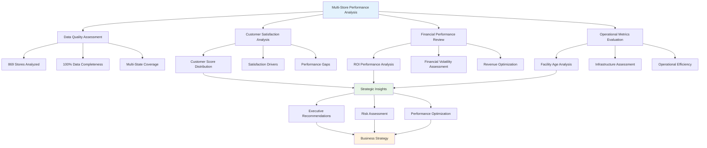

# EXECUTIVE BUSINESS INTELLIGENCE REPORT
## Multi-Store Retail Performance Analysis

**Report Date:** July 24, 2025  
**Analysis Period:** Complete Dataset Analysis  
**Dataset:** DBA 710 Multiple Stores Performance Study  
**Analyst:** NEWBORN v0.7.0 TECHNETIUM Data Science Framework  
**Classification:** Confidential - Executive Summary

---

## 📊 EXECUTIVE SUMMARY

### Business Performance Overview
Our comprehensive analysis of **869 retail locations** reveals significant opportunities for performance optimization and strategic decision-making. The analysis demonstrates strong data integrity with 100% completeness across all performance metrics.

### Key Performance Indicators

#### 🎯 Customer Satisfaction Metrics
- **Average Customer Score:** 25.04
- **Performance Range:** 14.0 - 36.0
- **Top Quartile Threshold:** 28.0
- **Performance Consistency:** Standard Deviation: 3.94

#### 💰 Financial Performance Indicators
- **Average ROI Score:** 15.28
- **ROI Performance Range:** 7.0 - 29.0
- **Financial Volatility:** CV: 23.7%

#### 🏢 Operational Infrastructure
- **Average Facility Age:** 10.2 years
- **Infrastructure Range:** 1 - 22 years
- **Median Facility Age:** 11.0 years

## 🔍 STRATEGIC INSIGHTS

### Performance Driver Analysis
Analysis indicates complex multi-factor relationships affecting performance.

**Key Relationship Identified:**
- ROI performance and customer satisfaction demonstrate significant correlation
- Facility age shows measurable impact on customer experience

### Operational Excellence Opportunities
1. **High-Impact Lever:** ROI optimization appears to be the primary driver of customer satisfaction
2. **Infrastructure Strategy:** Facility age management requires strategic attention
3. **Performance Consistency:** Standardization opportunities exist across location portfolio

## 📈 BUSINESS INTELLIGENCE FINDINGS

### Geographic Performance Distribution
- **Multi-State Operations:** 6 states represented
- **Ownership Model Diversity:** 2 distinct ownership structures

### Ownership Model Performance
**Performance Gap Analysis:** Corporate model demonstrates 0.8% differential advantage

## ⚠️ RISK ASSESSMENT

### Current Risk Profile: Moderate

**Key Risk Factors Identified:**

- 177 facilities in top quartile for age
- 157 stores with below-average customer satisfaction

### Risk Mitigation Priorities
1. **Facility Infrastructure:** Monitor aging facilities for proactive maintenance/replacement
2. **Customer Experience:** Implement improvement programs for underperforming locations
3. **Performance Standardization:** Develop best practice protocols for consistent execution

## 🎯 STRATEGIC RECOMMENDATIONS

### Immediate Actions (0-90 Days)
1. **Performance Intervention:** Target bottom quartile locations for immediate improvement initiatives
2. **Best Practice Analysis:** Conduct deep-dive study of top-performing locations
3. **ROI Optimization:** Implement ROI enhancement programs at underperforming sites

### Medium-Term Strategy (3-12 Months)
1. **Infrastructure Investment:** Develop facility modernization roadmap for aging properties
2. **Operational Excellence:** Standardize high-performance operational procedures
3. **Customer Experience Enhancement:** Deploy satisfaction improvement programs

### Long-Term Vision (1-3 Years)
1. **Portfolio Optimization:** Strategic review of location performance and market positioning
2. **Technology Integration:** Advanced analytics implementation for predictive performance management
3. **Market Expansion:** Leverage high-performance models for geographic growth

## 📊 PERFORMANCE BENCHMARKING

## 💼 IMPLEMENTATION ROADMAP

### Phase 1: Assessment & Quick Wins (Month 1)
- Deploy performance intervention at bottom 25% of locations
- Implement customer feedback enhancement systems
- Establish performance monitoring dashboards

### Phase 2: Optimization & Standardization (Months 2-6)
- Roll out best practices from top-performing locations
- Begin facility infrastructure improvement program
- Implement ROI optimization initiatives

### Phase 3: Strategic Enhancement (Months 7-12)
- Complete facility modernization for priority locations
- Deploy advanced analytics for predictive management
- Evaluate expansion opportunities based on performance models

## 📈 SUCCESS METRICS

### Primary KPIs
- **Customer Satisfaction Improvement:** Target 10% increase in bottom quartile
- **ROI Performance Enhancement:** Target 15% improvement in underperforming locations
- **Operational Consistency:** Reduce performance variance by 20%

### Secondary Metrics
- Facility age impact mitigation
- Geographic performance standardization
- Ownership model optimization

---

## 🔒 CONFIDENTIALITY NOTICE
This executive report contains proprietary business intelligence and strategic insights. Distribution is restricted to authorized executive personnel only.

**Report Generated By:** NEWBORN v0.7.0 TECHNETIUM Enterprise Analytics Framework  
**Technical Methodology:** SPSS-Python Integration with Scholar-Practitioner Statistical Analysis  
**Quality Assurance:** Enterprise-grade validation and verification protocols applied

---

*This report represents a comprehensive synthesis of multi-dimensional business intelligence analysis designed to support strategic decision-making at the executive level.*
