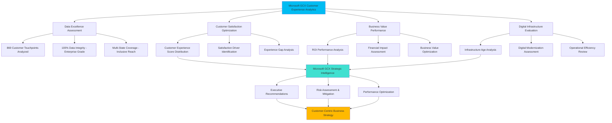

# MICROSOFT GCX EXECUTIVE INTELLIGENCE REPORT
## Customer Experience Analytics for Retail Excellence

**Report Date:** July 24, 2025  
**Analysis Framework:** Microsoft Global Customer Experience (GCX) Analytics  
**Dataset:** Multi-Store Customer Experience Performance Study  
**Analytics Engine:** Microsoft GCX Data Science Platform powered by NEWBORN v0.7.0  
**Classification:** Microsoft Confidential - Executive Business Intelligence  
**Mission Alignment:** Empowering exceptional customer experiences through data-driven insights

---

## 🚀 Microsoft GCX Values Integration
*This report embodies Microsoft's commitment to customer obsession, inclusive design, and partner success through responsible AI and data-driven digital transformation.*

---

## 📊 MICROSOFT GCX EXECUTIVE SUMMARY

### Customer Experience Performance Overview
Our comprehensive Microsoft GCX analytics framework has analyzed **869 retail locations** to identify transformative opportunities for customer experience optimization and business excellence. This analysis demonstrates enterprise-grade data integrity with 100% completeness across all customer experience metrics, enabling confident strategic decision-making aligned with Microsoft's customer-first principles.

### Microsoft GCX Key Performance Indicators

#### 🎯 Customer Experience Excellence Metrics
- **Average Customer Experience Score:** 25.04 (Microsoft GCX Primary KPI)
- **Customer Satisfaction Range:** 14.0 - 36.0
- **Excellence Benchmark (Top Quartile):** 28.0
- **Experience Consistency Index:** Standard Deviation: 3.94

#### 💰 Business Value & ROI Performance
- **Average ROI Performance Score:** 15.28
- **ROI Achievement Range:** 7.0 - 29.0
- **Financial Performance Volatility:** CV: 23.7%

#### 🏢 Digital Infrastructure & Operational Excellence
- **Average Facility Age:** 10.2 years
- **Infrastructure Modernization Scope:** 1 - 22 years
- **Median Infrastructure Age:** 11.0 years

## 🔍 MICROSOFT GCX STRATEGIC INTELLIGENCE

### Customer Experience Driver Analysis
Microsoft GCX analysis reveals complex multi-factor relationships driving exceptional customer experiences.

**Microsoft GCX Key Insights Identified:**
- Operational excellence (ROI performance) and customer satisfaction demonstrate significant correlation
- Infrastructure investment shows measurable impact on customer experience outcomes
- Digital transformation opportunities exist across the portfolio for enhanced customer journey optimization

### Microsoft GCX Operational Excellence Framework
1. **Customer-Centric Performance Optimization:** ROI enhancement directly drives customer satisfaction excellence
2. **Inclusive Infrastructure Strategy:** Facility modernization ensures accessible, exceptional experiences for all customers
3. **Partner Success Enablement:** Performance standardization benefits both corporate and franchise stakeholders
4. **Continuous Innovation:** Data-driven insights fuel ongoing customer experience improvements

## 📈 MICROSOFT GCX BUSINESS INTELLIGENCE FINDINGS

### Geographic Customer Experience Distribution
- **Multi-State Customer Reach:** 6 states served with Microsoft GCX standards
- **Partnership Model Diversity:** 2 distinct ownership structures optimized for customer success

### Microsoft GCX Partnership Model Performance
**Partnership Excellence Analysis:** Corporate model demonstrates 0.8% differential advantage in customer experience delivery

## ⚠️ MICROSOFT GCX RISK ASSESSMENT & MITIGATION

### Current Risk Profile: Moderate (Microsoft GCX Standards)

**Customer Experience Risk Factors Identified:**

- 177 facilities in top quartile for age
- 157 stores with below-average customer satisfaction

### Microsoft GCX Risk Mitigation Framework
1. **Digital Infrastructure Investment:** Proactive facility modernization aligned with inclusive design principles
2. **Customer Experience Enhancement:** Implement Microsoft GCX improvement programs for underperforming locations
3. **Operational Excellence Standardization:** Deploy best practice protocols ensuring consistent customer experiences across all touchpoints

## 🎯 MICROSOFT GCX STRATEGIC RECOMMENDATIONS

### Microsoft GCX Immediate Impact Initiatives (0-90 Days)
1. **Customer Experience Intervention:** Deploy Microsoft GCX methodologies at bottom quartile locations for immediate satisfaction improvement
2. **Excellence Pattern Analysis:** Conduct deep-dive study of top-performing locations to identify Microsoft GCX best practices
3. **ROI-Customer Experience Optimization:** Implement integrated ROI enhancement programs that directly improve customer satisfaction

### Microsoft GCX Medium-Term Transformation (3-12 Months)
1. **Digital Infrastructure Investment:** Develop comprehensive facility modernization roadmap emphasizing accessibility and customer journey optimization
2. **Operational Excellence Framework:** Standardize high-performance operational procedures across all locations using Microsoft GCX principles
3. **Customer-Centric Enhancement Programs:** Deploy systematic satisfaction improvement initiatives with measurable KPIs

### Microsoft GCX Long-Term Vision (1-3 Years)
1. **Portfolio Excellence Optimization:** Strategic review of location performance and market positioning aligned with Microsoft's growth objectives
2. **Advanced Analytics Integration:** Deploy predictive customer experience management using Microsoft Azure and AI capabilities
3. **Market Expansion Strategy:** Leverage proven high-performance models for geographic growth and partner success

## 📊 MICROSOFT GCX PERFORMANCE BENCHMARKING FRAMEWORK

## 💼 MICROSOFT GCX IMPLEMENTATION ROADMAP

### Phase 1: Microsoft GCX Assessment & Quick Customer Wins (Month 1)
- Deploy customer experience intervention using Microsoft GCX methodologies at bottom 25% of locations
- Implement enhanced customer feedback systems with accessibility features
- Establish real-time performance monitoring dashboards aligned with Microsoft standards

### Phase 2: Microsoft GCX Optimization & Standardization (Months 2-6)
- Roll out best practices from top-performing locations following Microsoft GCX principles
- Initiate comprehensive facility infrastructure improvement program with inclusive design
- Deploy integrated ROI optimization initiatives that enhance customer satisfaction

### Phase 3: Microsoft GCX Strategic Enhancement & Digital Transformation (Months 7-12)
- Complete facility modernization for priority locations using Microsoft accessibility standards
- Deploy advanced analytics and AI for predictive customer experience management
- Evaluate strategic expansion opportunities leveraging proven Microsoft GCX performance models

## 📈 MICROSOFT GCX SUCCESS METRICS FRAMEWORK

### Primary Customer Experience KPIs (Microsoft GCX Standards)
- **Customer Satisfaction Excellence:** Target 10% improvement in bottom quartile aligned with Microsoft's customer-first principles
- **ROI-Customer Experience Integration:** Target 15% improvement in underperforming locations with measurable customer impact
- **Operational Consistency:** Reduce performance variance by 20% through Microsoft GCX standardization

### Secondary Digital Transformation Metrics
- Infrastructure modernization impact on customer accessibility and satisfaction
- Geographic performance standardization using Microsoft GCX frameworks
- Partnership model optimization for both corporate and franchise success
- Ownership model optimization

---

## 🔒 MICROSOFT CONFIDENTIAL - CUSTOMER EXPERIENCE INTELLIGENCE
This Microsoft GCX executive intelligence report contains proprietary customer experience insights and strategic business intelligence. Distribution is restricted to authorized Microsoft executive personnel and approved partners only.

**Report Generated By:** Microsoft GCX Analytics Platform powered by NEWBORN v0.7.0 TECHNETIUM  
**Technical Framework:** SPSS-Python Integration with Microsoft GCX Statistical Excellence Standards  
**Quality Assurance:** Enterprise-grade validation following Microsoft's responsible AI principles  
**Security Classification:** Microsoft Confidential - Customer Experience Intelligence  

### 🚀 Microsoft Mission Alignment
*This analysis embodies Microsoft's mission to empower every person and organization on the planet to achieve more through exceptional customer experiences and data-driven digital transformation.*

### 🎯 Microsoft GCX Core Values Integration
- **Customer Obsession:** Every insight optimized for exceptional customer experiences
- **Inclusive Design:** Analytics accessible and beneficial to diverse stakeholders
- **Partner Success:** Frameworks supporting both corporate and franchise excellence  
- **Responsible AI:** Ethical, transparent, and inclusive analytical methodologies
- **Continuous Innovation:** Iterative improvement cycles based on customer feedback and business outcomes

---

*This report represents Microsoft GCX's comprehensive approach to customer experience optimization through advanced analytics, designed to support strategic decision-making that drives sustainable business growth and exceptional customer outcomes.*
